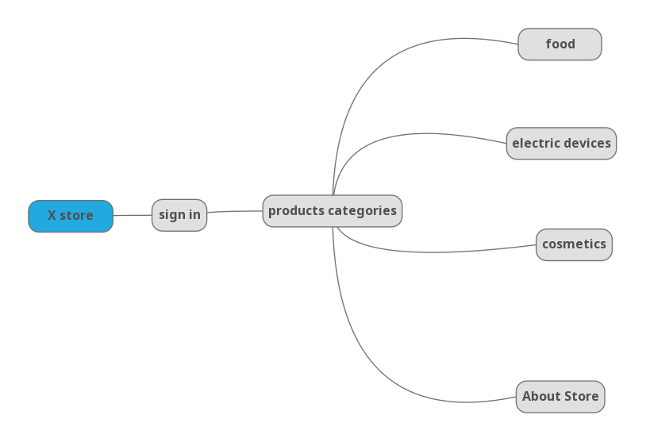
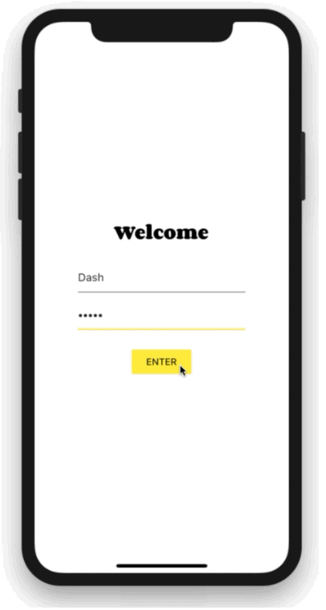
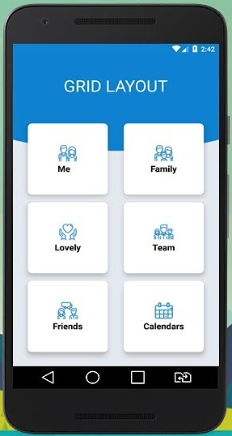
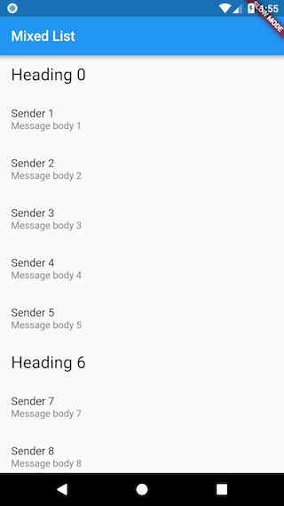
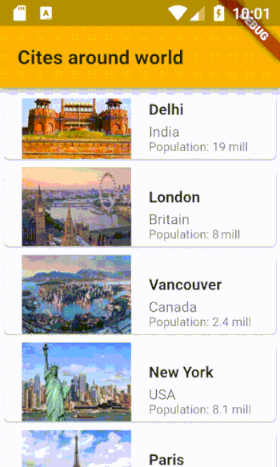
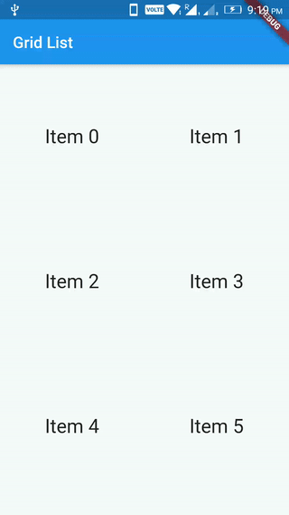

# 1-Basics of UI design in Flutter

- [write your first app (part1, part2)](https://flutter.dev/docs/get-started/codelab)
- [Basic Flutter layout concepts (with Exercise)](https://flutter.dev/docs/codelabs/layout-basics)
- [Introduction to widgets](https://flutter.dev/docs/development/ui/widgets-intro)
- [Layouts in Flutter](https://flutter.dev/docs/development/ui/layout)
- [Building layouts (Implementation)](https://flutter.dev/docs/development/ui/layout/tutorial)
- [Navigate to a new screen and back](https://flutter.dev/docs/cookbook/navigation/navigation-basics)

## putting it all together

> implementing a demo shop app to be familuar with flutter widgets
> and to good understand the basics of layout components in flutter

- ### Sign in
  
    Don't allow login with empty text fields
    
    

- ### Main

  - Buttons in Grid layout
  - menu and search icons in app bar
  
  

- ### Food

    List of text  (product name and price)
    
    

- ### Electrical devices

    list of Card widget with image, description and price
    
    

- ### Cosmetics

    Grid list with circular image
    
       

- ### About store
  
    Photo, contact&location icons and text info
    
    
