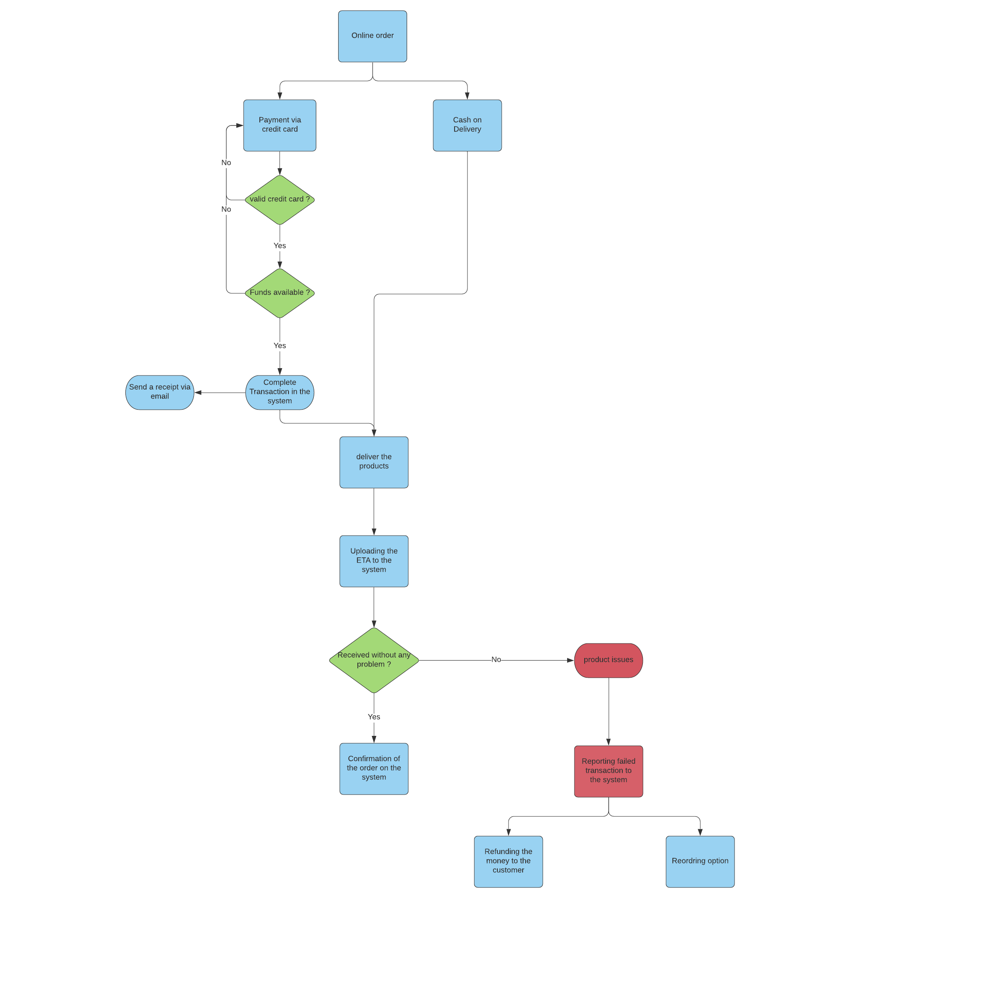

# Order Fulfillment for E-Commerce

## What is Order Fulfillment 

Order fulfillment is the process of storing inventory, picking and packing products, and shipping online orders to customers.
Ecommerce order fulfillment applies to business-to-consumer (B2C) orders that are shipped directly to a single shopper’s home.

-----
## Order Fulfillment for X-shops will go through 3 main steps 

**1. Customer orders online:**
This step includes the customer ordering the product from the internet then processing the order to get ready for pick & deliver.

**2. Pick & Deliver the order:**
This step includes uploading the information to the software that the order has been picked and on the way to the customer, the time when the customer should receive the order and the location of the customer.
    
**3. Receive or Return process:**
After delivering the order there are two actions that may happen :    
    1. Receiving the product without any problem and uploading the data to the software for  successful transaction.
    2. The product may have some issues and the customer may return the product and refuse to Receive it so it will be a failed transaction.

-----
## Flowchart of Order Fulfillment process

