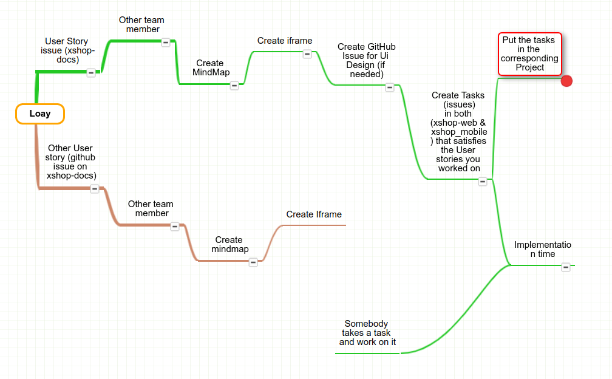

# User Stories

A list of user stories the system handles.

## Guidelines

- create a \<project_name_or_user_type\>_stories folder
- create a folder for each user story
- each folder contains
  - story MindMap
  - story wireframe_web > same mindmap creator
  - sotry wireframe_mobile > mobile dev
  - ui_ux_web
  - ui_ux_mobile

example: [superuser_stories](./superuser_stories)

please follow the example when you write a new
user story.
