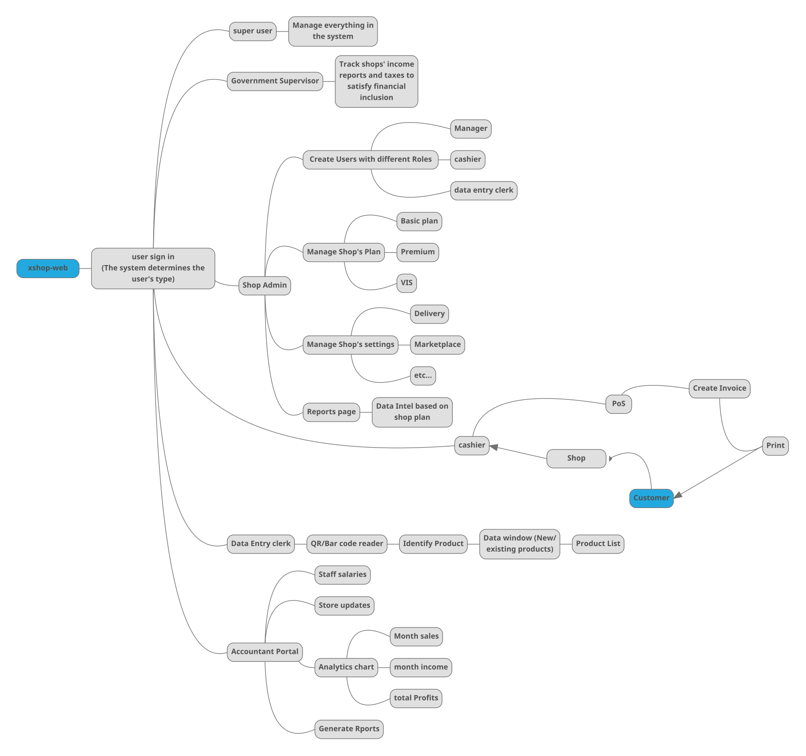

# XShop High Level Design

## Intro

XShop is a SaaS platform for Egyptian shops, that helps keep up with Egypt’s digital transformation and financial inclusion.

## Main Features

### Inventory & PoS

- Shop owners get an up-to-date system to manage their shops with minimal cost
- The system consists of a portal for the shop admin to manage staff members and define different types of users like managers, cashiers, and data entry clerks
  - cashiers can create invoices for customers
  - data entry specialists enter new products available in the shop
  - the system tracks sold products and update the DB accordingly

### Financial Inclusion

A portal for governmental supervisors to track the shops’ incomes and calculate taxes accordingly (extract reports)

### Online shopping

- A marketplace for customers to order products online
- This will be available based on shops that turn on this feature
- A customer shall use xshop’s mobile app to search for products
- Search results shall be from the nearest shop, per se
- A user can track the status of their order and get an invoice upon payment

### AI recommendation system

- Tracking user activities will help us
  - Inform shop owners/managers about products of high demand
  - Recommend products for customers to buy based on their shopping history

### Cashless payments

- Integrate different online payment methods
  - For the shops to pay their subscriptions
  - For the customers to pay for their orders online

## User Scenarios

- A customer shopping online
- A customer shopping physically
- A cashier creating an invoice for a customer
- A cashier receiving a returned product
- A clerk enters new incoming products
- A shop admin creating a cashier user
- A shop admin creating a manager user
- A shop admin editing their system settings
- A shop admin paying for their plan

*XShop mainly consists of xshop-web & xshop-mobile, The above scenarios are described in the graphs below.*

-----

## XShop web flow

## XShop mobile flow

